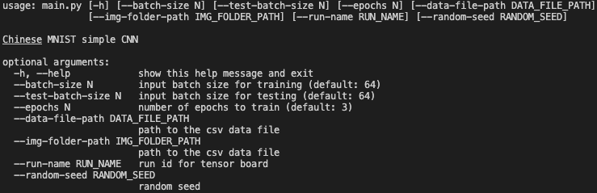
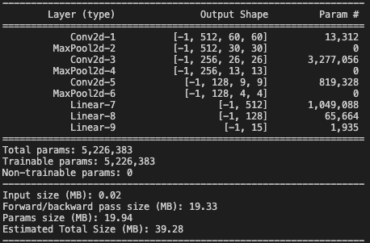
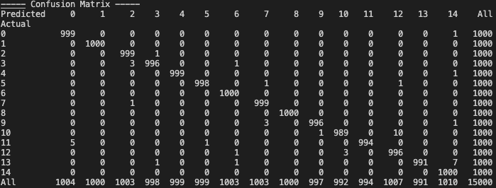

# Chinese MNIST

This project is to training a CNN model
for [Chinese MNIST Dataset](https://www.kaggle.com/gpreda/chinese-mnist) \
made by Allen Lin <weitung8@gmail.com>

## Usage

### Install Dependencies
```sh
pip install -r requirements.txt
```

### Train the model


### Network Architecture



## Accuracy
Training accuracy: 99.3%
Testing accurarcy: 99.8%

### Tensorboard
```sh
tensorboard --logdir runs
```

open [Tensorboard](http://localhost:6006) to see complete result

### Confusion Matrix


## References
* https://www.kaggle.com/ricafernandes/chinese-mnist-pytorch-cnn-92-training
* https://pytorch.org/tutorials/beginner/blitz/cifar10_tutorial.html
* https://github.com/pytorch/examples/blob/master/mnist/main.py
* https://github.com/pytorch/examples/blob/master/imagenet/main.py
